# Complete Coinbase Ecosystem Integration

**Snap Coffee** - Full integration with CDP Agent Kit, Server Wallets, MiniKit, and Onramp

## 🎯 Architecture Overview

```mermaid
graph TB
    User[👤 User in Farcaster] --> MiniKit[📱 MiniKit SDK]
    MiniKit --> Base[⚡ Base Network]
    
    CoffeeShop[☕ Coffee Shop] --> ServerWallet[🏪 Store Server Wallet]
    ServerWallet --> Base
    
    Platform[🎭 Snap Coffee Platform] --> AgentKit[🤖 CDP Agent Kit]
    AgentKit --> MasterWallet[👑 Master Server Wallet]
    MasterWallet --> Base
    
    User --> Onramp[💰 Coinbase Onramp]
    Onramp --> Base
    
    Base --> Contracts[📄 Smart Contracts]
    Contracts --> BEAN[🪙 $BEAN Token]
    Contracts --> NFT[🎫 NFT Coupons]
```



## 🚀 Complete Integration Stack

### 1. **CDP Agent Kit** - Autonomous AI Operations
- **Purpose**: AI-powered validation, reward distribution, and decision making
- **Capabilities**: Photo validation, automatic token transfers, coupon minting
- **Implementation**: `CoffeeRewardAgent` class with GPT-4 vision

### 2. **Server Wallets** - Store Infrastructure
- **Purpose**: Dedicated wallets for each coffee shop
- **Capabilities**: Automated coupon minting, redemption processing, analytics
- **Implementation**: `CDPServerWalletService` with store wallet management

### 3. **MiniKit** - Farcaster User Experience
- **Purpose**: Seamless wallet integration in Farcaster mini app
- **Capabilities**: Wallet connection, token transfers, transaction status
- **Implementation**: `useMiniKit` hook for React components

### 4. **Onramp** - Fiat-to-Crypto Conversion
- **Purpose**: Easy USDC purchasing for users/influencers
- **Capabilities**: Credit card to USDC, multiple purchase amounts
- **Implementation**: `EnhancedOnrampWidget` with contextual UI

## 📋 Implementation Status

### ✅ Backend - Server Infrastructure
- [x] CDP Agent Kit integration (`reward-agent.ts`)
- [x] Server Wallet service (`cdp-server-wallet.ts`) 
- [x] Agent API endpoints (`/api/agents/*`)
- [x] Store wallet creation and management
- [x] Autonomous reward distribution
- [x] NFT coupon contract deployment

### ✅ Frontend - User Experience  
- [x] MiniKit integration (`useMiniKit.ts`)
- [x] Enhanced Onramp widget (`EnhancedOnrampWidget.tsx`)
- [x] Farcaster mini app compatibility
- [x] Base network token transfers
- [x] Multi-tab onramp experience

### 🔄 Next Steps
1. **Deploy Smart Contracts**: $BEAN token, NFT coupon factory
2. **Environment Setup**: CDP API keys, contract addresses
3. **Store Onboarding**: Create server wallets for coffee shops
4. **Testing**: End-to-end flow validation

## 🎮 User Experience Flow

### **Coffee Snap Journey**
```
1. User opens Snap Coffee in Farcaster
2. MiniKit connects to their wallet
3. User takes coffee photo
4. Agent Kit validates photo with AI
5. Server wallet automatically sends BEAN rewards
6. After 10 coffees, store wallet mints NFT coupon
7. User redeems coupon with QR code at coffee shop
```

### **Creator Tipping Journey**
```
1. User discovers creator profile
2. Wants to tip $25 USDC
3. Insufficient balance triggers Onramp
4. User buys $50 USDC with credit card
5. MiniKit processes tip transaction
6. Creator receives USDC instantly on Base
```

### **Coffee Shop Integration**
```
1. New coffee shop discovered via Google Places
2. Agent Kit automatically creates store server wallet
3. Deploys store-specific NFT coupon contract
4. Funds wallet with gas money
5. Store can now mint/redeem coupons autonomously
6. Analytics dashboard shows store performance
```

## 🔧 Technical Implementation

### CDP Agent Kit Configuration

```typescript
// Enhanced agent with server wallet integration
const agent = new CdpAgent({
  agentkit: CdpAgentkit.configureWithWallet({
    cdpApiKeyName: process.env.CDP_API_KEY_NAME!,
    cdpApiKeyPrivateKey: process.env.CDP_API_KEY_PRIVATE_KEY!,
    networkId: 'base-mainnet',
    useServerSigner: true // Enable autonomous signing
  }),
  model: 'gpt-4o-mini',
  systemPrompt: 'Coffee validation expert with blockchain capabilities'
});
```

### Server Wallet Operations

```typescript
// Create dedicated wallet for coffee shop
const storeWallet = await cdpServerWalletService.createStoreWallet({
  storeName: "Blue Bottle Coffee",
  storeId: "blue_bottle_oakland_001",
  city: "Oakland",
  state: "CA",
  placeId: "ChIJ123abc456def"
});

// Automatically distribute rewards
await cdpServerWalletService.distributeReward({
  userAddress: "0x742d35Cc...",
  amount: 10,
  rewardType: 'BEAN_TOKEN',
  reason: 'coffee_snap_validated'
});
```

### MiniKit Integration

```typescript
// Seamless wallet connection in Farcaster
const { walletAddress, sendUSDCTip, mintCoupon } = useMiniKit();

// Send tip to creator
await sendUSDCTip({
  toAddress: creatorAddress,
  amount: "25",
  creatorName: "Coffee King ☕"
});

// Mint NFT coupon after 10 coffees
await mintCoupon({
  storeId: "blue_bottle_oakland_001",
  storeName: "Blue Bottle Coffee"
});
```

### Enhanced Onramp Experience

```typescript
// Contextual onramp for tipping
<EnhancedOnrampWidget
  isOpen={showOnramp}
  onClose={() => setShowOnramp(false)}
  purpose="tipping"
  targetAmount={25}
  creatorName="Coffee King ☕"
  onSuccess={(amount) => {
    // Auto-proceed with tip after purchase
    handleTip(amount);
  }}
/>
```

## 💰 Economic Model

### **Token Flow**
- **$BEAN Tokens**: Earned for coffee snaps (10-20 per validated photo)
- **NFT Coupons**: Minted after 10 coffees at same location
- **USDC Tips**: Direct creator support with fiat onramp
- **Store Revenue**: Analytics and customer engagement data

### **Revenue Streams**
1. **Transaction Fees**: Small percentage on tips and rewards
2. **Store Subscriptions**: Premium analytics and marketing tools
3. **Onramp Commissions**: Revenue share with Coinbase Commerce
4. **Data Insights**: Anonymized coffee consumption analytics

## 🔒 Security & Compliance

### **Server Wallet Security**
- Private keys managed by CDP infrastructure
- Automated transaction limits and monitoring
- Multi-signature requirements for large transfers
- Regular security audits and key rotation

### **User Privacy**
- No personal data stored on-chain
- Venue identification via hashed Place IDs
- Optional profile information with user consent
- GDPR/CCPA compliant data handling

### **Smart Contract Security**
- Comprehensive test suites with Foundry
- External security audits before mainnet
- Upgradeability patterns for bug fixes
- Emergency pause mechanisms

## 📊 Analytics & Monitoring

### **Real-time Metrics**
- Coffee snap validation rates and accuracy
- Token distribution patterns and volumes
- Store engagement and coupon redemption rates
- User retention and activity patterns

### **Business Intelligence**
- Coffee consumption trends by location/time
- Creator performance and engagement metrics
- Onramp conversion rates and user flows
- Revenue attribution across different streams

## 🎯 Success Metrics

### **User Engagement**
- **Target**: 10K+ monthly active users
- **Metric**: Average 3 coffee snaps per user per week
- **Goal**: 80% user retention after 4 weeks

### **Economic Activity**
- **Target**: $50K+ monthly tip volume
- **Metric**: Average $15 USDC tips per creator per week
- **Goal**: 60% onramp conversion rate

### **Store Adoption**  
- **Target**: 500+ coffee shops with server wallets
- **Metric**: 70% coupon redemption rate
- **Goal**: $100K+ annual revenue from store subscriptions

## 🚀 Launch Strategy

### **Phase 1: MVP Testing** (Weeks 1-2)
- Deploy on Base Sepolia testnet
- 10 beta coffee shops with server wallets
- 50 beta users testing full flow
- Agent Kit validation accuracy optimization

### **Phase 2: Mainnet Launch** (Weeks 3-4)
- Deploy all contracts to Base mainnet
- 50 coffee shops in SF/NYC markets
- Full Coinbase Onramp integration
- Creator tipping campaigns

### **Phase 3: Scale & Expand** (Weeks 5-8)
- 500+ coffee shops across major cities
- Influencer partnership programs
- Advanced AI features and personalization
- Mobile app store deployment

## 🛠️ Development Setup

### **Required Environment Variables**

```bash
# CDP Agent Kit & Server Wallets
CDP_API_KEY_NAME=your_cdp_api_key_name
CDP_API_KEY_PRIVATE_KEY=your_cdp_api_key_private_key
OPENAI_API_KEY=your_openai_api_key

# Smart Contracts (after deployment)
BEAN_TOKEN_ADDRESS=0x1234...
NFT_FACTORY_ADDRESS=0x5678...
COUPON_NFT_ADDRESS=0x9abc...

# Coinbase Onramp
VITE_ONRAMP_APP_ID=your_onramp_app_id

# Base Network
BASE_RPC_URL=https://mainnet.base.org
MASTER_WALLET_ID=your_master_wallet_id
```

### **Quick Start Commands**

```bash
# Backend setup
cd Backend
npm install
npm run dev

# Frontend setup  
cd FrontEnd
npm install
npm run dev

# Test full integration
curl -X POST https://stage.agentix.cc/api/agents/validate-snap \
  -H "Content-Type: application/json" \
  -d '{"imageUrl":"https://example.com/coffee.jpg","userAddress":"0x742d35Cc...","venueName":"Blue Bottle","city":"Oakland","state":"CA","coffeeType":"Gibraltar"}'
```

## 🎉 Expected Impact

### **For Users**
- ⚡ **Instant Rewards**: AI validation + automatic token distribution
- 💰 **Easy Tipping**: Fiat-to-crypto onramp + one-click tips  
- 🎫 **Real Value**: NFT coupons redeemable at coffee shops
- 📱 **Seamless UX**: Native Farcaster integration

### **For Coffee Shops**
- 🏪 **Automated Operations**: Server wallets handle all blockchain transactions
- 📊 **Rich Analytics**: Customer insights and engagement metrics
- 💸 **New Revenue**: Digital loyalty and customer acquisition
- 🤖 **Zero Maintenance**: AI agents handle complex operations

### **For Creators**
- 💰 **Direct Monetization**: USDC tips with no intermediaries
- 📈 **Growth Tools**: Analytics and audience insights
- 🎯 **Engagement**: Reward-driven content creation
- 🌐 **Global Reach**: Base network enables worldwide tipping

---

## 🎯 Ready to Launch!

The complete Coinbase ecosystem integration is ready for deployment. This combines the power of:

- **🤖 CDP Agent Kit**: Autonomous AI operations
- **🏪 Server Wallets**: Coffee shop infrastructure  
- **📱 MiniKit**: Seamless Farcaster UX
- **💰 Onramp**: Easy fiat-to-crypto conversion

**Next Step**: Deploy smart contracts and start onboarding coffee shops with their dedicated server wallets!