# Snap Coffee - Base Mini App with Full CDP Ecosystem Integration

> 🏆 **CDP Challenge Participant** - Building the future of Web3 coffee loyalty with Coinbase Developer Platform

[](https://base.org)
[](https://docs.cdp.coinbase.com/agent-kit)
[](https://docs.cdp.coinbase.com/server-wallets)
[](https://docs.base.org/base-app)
[](https://docs.coinbase.com/onramp)
[](https://opensource.org/licenses/MIT)

---

## 🏆 CDP Challenge Tracks

Snap Coffee participates in **4 Coinbase Developer Platform challenge tracks**, showcasing the complete CDP ecosystem integration:

### 🤖 **Monetized AI Agents** - CDP Agent Kit
**Challenge**: Build AI agents that can autonomously perform on-chain actions
- **Our Implementation**: GPT-4 Vision agent validates coffee photos and distributes $BEAN rewards
- **Code**: [`Backend/src/agents/reward-agent.ts`](./Backend/src/agents/reward-agent.ts)
- **Key Features**: Autonomous coffee validation, smart reward distribution, fraud detection

### 🏪 **Build a Base Mini-App + CDP** - Server Wallets & MiniKit  
**Challenge**: Create Farcaster mini app with CDP wallet infrastructure
- **Our Implementation**: Full MiniKit integration with automated coffee shop wallets
- **Code**: [`FrontEnd/src/hooks/useMiniKit.ts`](./FrontEnd/src/hooks/useMiniKit.ts) + [`Backend/src/services/cdp-server-wallet.ts`](./Backend/src/services/cdp-server-wallet.ts)
- **Key Features**: Seamless Farcaster UX, server wallet automation, USDC tipping

### 💳 **Onchain Checkout Flow** - Enhanced Onramp
**Challenge**: Streamlined fiat-to-crypto conversion with contextual UI  
- **Our Implementation**: Multi-tab onramp widget with coffee-specific use cases
- **Code**: [`FrontEnd/src/components/EnhancedOnrampWidget.tsx`](./FrontEnd/src/components/EnhancedOnrampWidget.tsx)
- **Key Features**: Contextual onboarding, tip preparation, reward top-ups

### 🏦 **CDP Wallets** - Infrastructure & Analytics
**Challenge**: Leverage CDP wallet infrastructure for business operations
- **Our Implementation**: Coffee shop server wallets with automated NFT minting
- **Code**: [`Backend/src/controllers/agent.ts`](./Backend/src/controllers/agent.ts)
- **Key Features**: Per-store wallets, coupon automation, revenue analytics

---

## 🏗️ Solution Architecture

### System Overview

```mermaid
graph TB
    subgraph "User Layer"
        U[👤 Coffee Lovers]
        I[🌟 Influencers]
        S[☕ Coffee Shops]
    end
    
    subgraph "Frontend - Base MiniKit App"
        F[📱 React + Vite App]
        M[🔗 MiniKit SDK]
        O[💳 Enhanced Onramp]
        W[🏦 Wallet Integration]
    end
    
    subgraph "Backend Services"
        A[🤖 CDP Agent Kit]
        SW[🏪 Server Wallets]
        API[🔌 Node.js API]
        FB[🔥 Firebase Storage]
    end
    
    subgraph "Base Network"
        B[⚡ Base Blockchain]
        SC[📜 Smart Contracts]
        T[🪙 $BEAN Token]
        N[🎫 NFT Coupons]
    end
    
    subgraph "External Services"
        FC[📡 Farcaster]
        GM[🗺️ Google Maps]
        OA[🧠 OpenAI GPT-4]
        CB[💰 Coinbase Pay]
    end
    
    U --> F
    I --> F
    S --> F
    
    F <--> M
    F <--> O
    F <--> W
    F <--> API
    
    API <--> A
    API <--> SW
    API <--> FB
    
    A --> B
    SW --> B
    B <--> SC
    SC <--> T
    SC <--> N
    
    A <--> OA
    API <--> FC
    API <--> GM
    O <--> CB
    
    style A fill:#00D4FF
    style SW fill:#00D4FF  
    style M fill:#0052FF
    style O fill:#0052FF
    style B fill:#0052FF
```


### CDP Technology Integration Map

```mermaid
graph LR
    subgraph "📱 Frontend"
        MK[MiniKit SDK<br/>useMiniKit.ts]
        EO[Enhanced Onramp<br/>EnhancedOnrampWidget.tsx]
        OW[Basic Onramp<br/>OnrampWidget.tsx]
    end
    
    subgraph "🤖 Backend AI"
        AK[Agent Kit<br/>reward-agent.ts]
        AC[Agent Controller<br/>agent.ts]
    end
    
    subgraph "🏪 Infrastructure" 
        SW[Server Wallets<br/>cdp-server-wallet.ts]
        AR[Agent Routes<br/>agents.ts]
    end
    
    subgraph "⚡ Base Network"
        BC[Smart Contracts]
        TK[$BEAN Tokens]
        NFT[NFT Coupons]
    end
    
    MK -->|USDC Tips| BC
    EO -->|Fiat→Crypto| BC
    OW -->|Card Payments| BC
    
    AK -->|Autonomous Actions| BC
    AC -->|API Gateway| AK
    
    SW -->|Automated Minting| BC
    AR -->|Route Management| SW
    
    AK -.->|GPT-4 Vision| OpenAI[🧠 OpenAI]
    SW -.->|Wallet Creation| CDP[🏦 CDP Platform]
    MK -.->|Social Layer| Farcaster[📡 Farcaster]
    EO -.->|Payment Flow| Coinbase[💳 Coinbase Pay]
    
    style AK fill:#00D4FF
    style SW fill:#00D4FF
    style MK fill:#0052FF  
    style EO fill:#0052FF
```


---

## 🔄 User Interaction Flow

### Complete Coffee Journey

```mermaid
sequenceDiagram
    participant U as 👤 User
    participant F as 📱 Frontend
    participant M as 🔗 MiniKit
    participant A as 🤖 Agent Kit
    participant S as 🏪 Server Wallet
    participant B as ⚡ Base Network
    participant FC as 📡 Farcaster
    
    Note over U,FC: 1. User Onboarding
    U->>F: Open Snap Coffee App
    F->>M: Initialize MiniKit SDK
    M->>FC: Connect to Farcaster
    FC-->>M: User Profile & Wallet
    M-->>F: Wallet Connected
    F-->>U: Welcome + Explore Feed
    
    Note over U,FC: 2. Coffee Snap & Validation
    U->>F: Take Coffee Photo
    F->>F: Add Location + Details
    U->>F: Submit Coffee Snap
    F->>A: Send for AI Validation
    A->>A: GPT-4 Vision Analysis
    A->>B: Distribute $BEAN Rewards
    B-->>A: Transaction Confirmed
    A-->>F: Validation + Reward Result
    F-->>U: ✅ Coffee Validated!
    
    Note over U,FC: 3. Social Sharing & Tips
    F->>FC: Post to Farcaster Feed
    FC-->>F: Post Created
    U->>F: View Creator Content
    U->>F: Tip Creator (Fiat)
    F->>M: Process USDC Tip
    M->>B: Execute Tip Transaction
    B-->>M: Tip Sent
    M-->>F: Tip Confirmed
    F-->>U: ✅ Creator Tipped!
    
    Note over U,FC: 4. Reward Milestone
    A->>A: Check User Progress
    A->>S: User Hit 10 Coffees
    S->>B: Mint NFT Coupon
    B-->>S: NFT Minted
    S-->>A: Coupon Created
    A-->>F: 🎫 NFT Coupon Ready!
    F-->>U: Congratulations!
    
    Note over U,FC: 5. Coupon Redemption
    U->>F: Show QR Code at Shop
    F->>A: Validate Redemption
    A->>B: Burn/Mark NFT Used
    B-->>A: Redemption Confirmed
    A-->>F: ✅ Free Coffee!
    F-->>U: Enjoy Your Reward!
```


### Fiat-to-Crypto Onramp Flow

```mermaid
sequenceDiagram
    participant U as 👤 User
    participant F as 📱 Frontend
    participant O as 💳 Onramp Widget
    participant CB as 🏦 Coinbase Pay
    participant B as ⚡ Base Network
    participant M as 🔗 MiniKit
    
    Note over U,M: Enhanced Onramp Experience
    U->>F: Want to Tip Creator
    F->>F: Check USDC Balance
    F->>O: Show Contextual Onramp
    O->>O: "Top up for tipping"
    
    U->>O: Select $25 for Tips
    O->>CB: Open Coinbase Pay
    CB->>U: Enter Payment Method
    U->>CB: Complete Purchase
    CB->>B: Send USDC to Wallet
    B-->>CB: Transaction Confirmed
    CB-->>O: Purchase Success
    O-->>F: Balance Updated
    F->>M: Enable Tip with New Funds
    M-->>U: ✅ Ready to Tip!
    
    Note over U,M: Multiple Use Cases
    rect rgb(240, 248, 255)
        Note over O: Tab 1: Tip Creators
        Note over O: Tab 2: Top Up Rewards  
        Note over O: Tab 3: General Wallet
    end
```


---

## **Snap Coffee is Based**

Snap Coffee is a social mini app and on-chain loyalty platform built on **Base** to onboard millions of new Web3 users by targeting one of the largest and most passionate global consumer segments: **daily coffee drinkers,** over **1 billion people worldwide**.

We start with a simple, familiar action: taking a photo of your coffee. Every verified coffee purchase earns on-chain points, and after 10 coffees, users receive an **NFT coupon** for their 11th coffee, instantly redeemable at participating cafés.

## The Problem

Traditional loyalty programs are broken:

- **Paper cards get lost, damaged, or forgotten** 📄❌
- **Café owners lack reliable customer data and insights** 📊❌ 
- **Loyalty isn't engaging** — it's transactional and disconnected from the coffee culture ☕❌

## The Solution

Using **Base** for low-cost, fast, and scalable transactions, Snap Coffee creates a **geolocated, on-chain customer database** enriched with demographic insights. This enables café owners to:

- ⚡ **Track visits in real time**
- 🎯 **Understand customer behavior** by location, time of day, and preferences  
- 🚀 **Run targeted marketing campaigns** and personalized rewards

## Sustainable Business Model

Snap Coffee generates revenue through:

1. **💼 B2B SaaS subscriptions** for cafés to access loyalty, analytics, and marketing tools
2. **💳 Transaction fees** for each redeemed NFT coupon
3. **🎪 Brand sponsorships** from coffee, equipment, and lifestyle companies

By fixing the **loyalty gap** and creating a shareable, gamified coffee culture, Snap Coffee drives mass adoption of Base, turning a daily habit into global on-chain engagement.

---

## ✨ Key Features

### For Coffee Lovers 👥
- 📸 **Instagram-style Coffee Feed** - Share and discover local coffee culture  
- 🪙 **Earn $BEAN Tokens** - Get rewards for every verified coffee purchase
- 🎫 **NFT Coupon Rewards** - Redeem your 11th coffee with blockchain-backed coupons
- 💰 **Creator Tipping** - Support coffee influencers with fiat-to-crypto payments
- 🏆 **Social Rankings** - Compete on local coffee leaderboards

### For Coffee Shops ☕
- 📊 **Real-time Analytics Dashboard** - Track visits, peak hours, popular drinks
- 🎯 **Customer Insights** - Understand demographics, preferences, and behavior patterns
- 🎪 **Marketing Campaigns** - Run targeted promotions and loyalty programs  
- 💎 **NFT Coupon System** - Automated redemption with fraud protection
- 📈 **Revenue Growth** - Increase customer retention and average visit value

### For the Ecosystem 🌍
- 🔗 **Web3 Onboarding** - Seamless transition from Web2 to Web3 through familiar actions
- ⚡ **Base Network Integration** - Fast, cheap transactions for global scale
- 🛡️ **Privacy-First** - Location data hashed, no raw GPS coordinates on-chain
- 🤖 **AI Content Moderation** - Automated fraud detection and quality control

---

## 💻 Technical Implementation

### Frontend Stack - Base MiniKit App
- **Framework**: React 18 + Vite + TypeScript
- **Styling**: Tailwind CSS + shadcn/ui components  
- **Web3**: OnchainKit for wallet integration
- **Farcaster**: MiniKit SDK ([`useMiniKit.ts`](./FrontEnd/src/hooks/useMiniKit.ts))
- **Payments**: Enhanced Onramp widget ([`EnhancedOnrampWidget.tsx`](./FrontEnd/src/components/EnhancedOnrampWidget.tsx))
- **State**: React Query + local storage
- **Mobile**: PWA-ready responsive design optimized for Farcaster frames

### Smart Contracts (Base Network)
```solidity
LoyaltyToken.sol      // ERC20 $BEAN rewards system
RewardsController.sol // Coffee verification & reward distribution
CouponNFT.sol         // ERC721 redeemable coffee coupons  
SnapRegistry.sol      // Event logging and verification
```

#### Deployed Contracts (Base Sepolia Testnet)

| Contract | Address | BaseScan Explorer | Status |
|----------|---------|-------------------|--------|
| **$BEAN Token** | `0xC74C0f76acA119B8e68F7A4f7580E80f0BE42752` | [View Contract →](https://sepolia.basescan.org/address/0xC74C0f76acA119B8e68F7A4f7580E80f0BE42752#code) | ✅ Verified |
| **RewardsController** | `0xE3b30Cc77dfbEBC69C3c1e40703C792A934dE834` | [View Contract →](https://sepolia.basescan.org/address/0xE3b30Cc77dfbEBC69C3c1e40703C792A934dE834#code) | ✅ Verified |

**Key Features:**
- 🪙 **$BEAN Token**: ERC20 rewards with 3 BEAN per verified coffee
- 🛡️ **Anti-fraud**: Daily limits (10 coffees/user), 30min cooldowns per location
- 👥 **Merchant System**: Registration and analytics for coffee shops
- 🔍 **Full Transparency**: Complete source code verified on BaseScan

### Backend Services - CDP Ecosystem
- **Runtime**: Node.js + TypeScript
- **AI Agent**: CDP Agent Kit with GPT-4 Vision ([`reward-agent.ts`](./Backend/src/agents/reward-agent.ts))
- **Wallets**: CDP Server Wallet v2 service ([`cdp-server-wallet.ts`](./Backend/src/services/cdp-server-wallet.ts))
- **API**: Agent controller endpoints ([`agent.ts`](./Backend/src/controllers/agent.ts))
- **Payments**: Enhanced CDP Onramp integration
- **Storage**: Firebase + IPFS for media with on-chain content hashes

#### Key CDP Features Implemented
- 🤖 **Autonomous AI Agents**: Coffee validation + reward distribution
- 🏪 **Per-Store Server Wallets**: Automated coffee shop infrastructure  
- 🔗 **Farcaster Integration**: Native MiniKit SDK for seamless UX
- 💳 **Contextual Onramp**: Multi-use case fiat-to-crypto conversion

### Data Layer
- **Indexing**: CDP Data SQL API for on-chain events
- **Events**: SnapPosted, RewardGranted, CouponRedeemed, Tipped
- **Privacy**: Venue IDs (hashed) instead of raw coordinates
- **Analytics**: Real-time dashboard for coffee shop insights

---

## 🚀 Getting Started

### Prerequisites
- Node.js 18+
- npm/yarn/pnpm
- CDP API keys ([Get them here](https://portal.cdp.coinbase.com))
- OpenAI API key for Agent Kit
- Firebase project for storage

### Quick Start
```bash
# Clone the repository
git clone https://github.com/your-username/snap-coffee
cd snap-coffee

# Install dependencies for both frontend and backend
cd FrontEnd && npm install
cd ../Backend && npm install
```

### Environment Setup

#### Frontend Configuration
Copy the example environment file and configure CDP settings:
```bash
cd FrontEnd
cp .env.example .env
```

Key variables to configure:
```bash
# Coinbase Ecosystem
VITE_BEAN_TOKEN_ADDRESS=your_deployed_bean_token_address
VITE_USDC_TOKEN_ADDRESS=0x833589fCD6eDb6E08f4c7C32D4f71b54bdA02913
VITE_ONRAMP_APP_ID=your_coinbase_onramp_app_id
VITE_MINIKIT_ENABLED=true

# Base Network
VITE_BASE_RPC_URL=https://sepolia.base.org
VITE_CHAIN_ID=84532
```

#### Backend Configuration  
Configure CDP Agent Kit and Server Wallets:
```bash
cd Backend
cp .env.example .env
```

Key variables for CDP integration:
```bash
# CDP Agent Kit
CDP_API_KEY_NAME=your_cdp_api_key_name
CDP_API_KEY_PRIVATE_KEY=your_cdp_api_key_private_key
OPENAI_API_KEY=your_openai_api_key

# Server Wallets
CDP_WALLET_ID=your_server_wallet_id
CDP_NETWORK=base-sepolia

# Smart Contracts
LOYALTY_TOKEN_ADDRESS=your_deployed_bean_token
```

### Start Development
```bash
# Terminal 1: Start backend API with Agent Kit
cd Backend && npm run dev

# Terminal 2: Start frontend MiniKit app
cd FrontEnd && npm run dev
```

### Available Scripts
```bash
npm run dev          # Start development server
npm run build        # Production build
npm run preview      # Preview production build  
npm run lint         # Run ESLint
```

---

## 📱 User Journey

### 1. **Onboard** 🚀
- Connect wallet via OnchainKit (smart wallet creation)
- Grant location permissions or manual café search
- Explore local coffee feed powered by CDP Data API

### 2. **Snap & Share** 📸
- Take coffee photo with camera integration
- Select café location with auto-suggestion
- Add coffee type, rating, and pairing recommendation
- AI validation + on-chain event logging

### 3. **Earn & Progress** 🎯
- Receive $BEAN tokens for verified posts
- Track progress toward 10-coffee milestone  
- Social engagement through likes and tips

### 4. **Redeem Rewards** 🎫
- Automatic NFT coupon minting at 10 coffees
- QR code redemption at participating cafés
- On-chain verification and fraud protection

### 5. **Tip Creators** 💰
- Support coffee influencers with fiat payments
- CDP Onramp converts to USDC on Base
- Transparent tipping leaderboards

---

## 🛠️ CDP Technology Deep Dive

### 🤖 CDP Agent Kit Implementation
**File**: [`Backend/src/agents/reward-agent.ts`](./Backend/src/agents/reward-agent.ts)

Our autonomous AI agent handles the complete coffee validation and reward cycle:

```typescript
export class CoffeeRewardAgent {
  private agent: CdpAgent;
  private agentkit: CdpAgentkit;
  
  // GPT-4 Vision validates coffee photos autonomously
  async validateAndReward(params: {
    imageUrl: string;
    userAddress: string;
    venueName: string;
    // ... more params
  }): Promise<AgentResult>
}
```

**Key Capabilities**:
- 🧠 **GPT-4 Vision Analysis**: Validates coffee authenticity, venue matching, quality assessment
- ⚡ **Autonomous Transactions**: Directly distributes $BEAN tokens without manual intervention
- 🛡️ **Fraud Detection**: AI-powered spam and duplicate detection
- 🏆 **Smart Rewards**: Context-aware reward amounts (new venue bonuses, streak multipliers)

### 🏪 CDP Server Wallets Infrastructure
**File**: [`Backend/src/services/cdp-server-wallet.ts`](./Backend/src/services/cdp-server-wallet.ts)

Automated wallet infrastructure for every coffee shop:

```typescript
export class CDPServerWalletService {
  // Creates dedicated wallet for each coffee shop
  async createStoreWallet(params: {
    storeName: string;
    storeId: string;
    city: string;
    state: string;
    placeId: string;
  }): Promise<StoreWalletResult>
  
  // Automated NFT coupon minting
  async mintStoreCoupon(storeWallet: Wallet, userAddress: string): Promise<MintResult>
}
```

**Infrastructure Benefits**:
- 🏦 **Per-Store Wallets**: Each coffee shop gets dedicated on-chain wallet
- 🎫 **Automated NFT Minting**: No manual intervention for coupon creation
- 📊 **Revenue Analytics**: Track redemptions, tips, engagement per store
- ⚡ **Gas Optimization**: Batch transactions and subsidized gas fees

### 🔗 MiniKit SDK Integration  
**File**: [`FrontEnd/src/hooks/useMiniKit.ts`](./FrontEnd/src/hooks/useMiniKit.ts)

Seamless Farcaster experience with native Web3 UX:

```typescript
export const useMiniKit = () => {
  // Native Farcaster wallet connection
  const connectWallet = useCallback(async () => {
    return await connectWallet();
  }, []);
  
  // USDC tipping with MiniKit
  const sendUSDCTip = useCallback(async (params: {
    toAddress: string;
    amount: string;
    creatorName: string;
  }) => {
    const { transactionId } = await tokenTransfer(transferParams);
    return { success: true, transactionHash: transactionId };
  }, []);
}
```

**MiniKit Advantages**:
- 🎯 **Native Farcaster UX**: Users never leave the familiar Farcaster environment
- ⚡ **Instant Transactions**: Base network enables sub-second transaction finality
- 🔄 **Social Integration**: Coffee posts automatically sync with Farcaster feed
- 💰 **Embedded Tipping**: Native USDC transfers without external wallet switching

### 💳 Enhanced Onramp Experience
**File**: [`FrontEnd/src/components/EnhancedOnrampWidget.tsx`](./FrontEnd/src/components/EnhancedOnrampWidget.tsx)

Context-aware fiat-to-crypto conversion with coffee-specific UX:

```typescript
const EnhancedOnrampWidget = ({ context }: { context: OnrampContext }) => {
  const tabs = [
    { id: 'tip', label: '☕ Tip Creators', description: 'Support coffee influencers' },
    { id: 'rewards', label: '🪙 Top Up Rewards', description: 'Buy more $BEAN tokens' },
    { id: 'wallet', label: '💰 Add to Wallet', description: 'General USDC purchase' }
  ];
  
  // Context-aware onboarding and amounts
  const getContextualAmounts = (context: string) => {
    switch (context) {
      case 'tip': return [5, 10, 25]; // Tip-appropriate amounts
      case 'rewards': return [25, 50, 100]; // Reward bundle amounts
      default: return [50, 100, 250]; // General wallet amounts
    }
  };
};
```

**Enhanced Features**:
- 📱 **Contextual UI**: Different interfaces for tipping, rewards, general wallet funding
- 🎯 **Smart Amounts**: Pre-configured amounts for different use cases
- 🔄 **Onboarding Flow**: Guided experience explains USDC, Base, and wallet concepts
- ✅ **Success Integration**: Seamlessly returns to intended action after purchase

---

## ⚡ Why Base Network Powers Our Vision

### Technical Advantages
- **⚡ Fast & Cheap**: Sub-second finality, <$0.01 transactions enable micro-rewards
- **🔗 Ethereum Compatible**: Full EVM compatibility with existing tooling
- **🏗️ Developer Experience**: OnchainKit, MiniKit, and CDP tools built for Base
- **📈 Scalability**: Handles millions of daily coffee transactions globally

### User Experience Benefits  
- **🚀 Instant Rewards**: No waiting for confirmations on $BEAN token distribution
- **💰 Affordable Tipping**: Enable $1-5 tips without prohibitive gas fees  
- **📱 Mobile First**: Optimized for mobile wallet and Farcaster integration
- **🌍 Global Reach**: Low costs enable worldwide coffee community participation

### Business Model Enablement
- **🏪 Coffee Shop Adoption**: Low transaction costs make loyalty programs profitable
- **💳 Fiat-to-Crypto Bridge**: Coinbase ecosystem integration simplifies onboarding
- **📊 Real-time Analytics**: Fast block times enable live dashboard updates
- **🎯 Targeted Campaigns**: Efficient micro-transactions enable granular marketing

Base is the only L2 that combines technical excellence with a comprehensive ecosystem (CDP, OnchainKit, MiniKit, Farcaster integration) purpose-built for consumer applications like Snap Coffee.

---

## 🛣️ Development Roadmap

### Phase 1: MVP Foundation ✅
- [x] React frontend with mobile-first UI optimized for Farcaster
- [x] Camera integration and photo workflow
- [x] Progress tracking and localStorage persistence  
- [x] Instagram-style feed with coffee cards
- [x] Base network smart contracts (BEAN Token + RewardsController)
- [x] OnchainKit wallet integration

### Phase 2: CDP Ecosystem Integration ✅
- [x] ERC20 $BEAN token implementation (3 BEAN per coffee reward)
- [x] Smart contract rewards controller with anti-fraud protection
- [x] **CDP Agent Kit**: GPT-4 Vision autonomous validation ([`reward-agent.ts`](./Backend/src/agents/reward-agent.ts))
- [x] **CDP Server Wallets**: Per-store wallet automation ([`cdp-server-wallet.ts`](./Backend/src/services/cdp-server-wallet.ts))
- [x] **MiniKit SDK**: Native Farcaster integration ([`useMiniKit.ts`](./FrontEnd/src/hooks/useMiniKit.ts))
- [x] **Enhanced Onramp**: Contextual fiat-to-crypto ([`EnhancedOnrampWidget.tsx`](./FrontEnd/src/components/EnhancedOnrampWidget.tsx))
- [x] Agent API endpoints for autonomous operations ([`agent.ts`](./Backend/src/controllers/agent.ts))

### Phase 3: Advanced Features & Scale 🔄
- [ ] ERC721 NFT coupon system completion
- [ ] Coffee shop analytics dashboard with CDP wallet data
- [ ] Advanced AI moderation pipeline with Agent Kit
- [ ] B2B SaaS subscription system
- [ ] Brand partnership integration

### Phase 4: Growth & Optimization 🚀
- [ ] Mobile app (React Native/PWA)
- [ ] Advanced gamification features
- [ ] Multi-language support  
- [ ] Enterprise café management tools
- [ ] Cross-chain compatibility research

---

## 🏪 Business Model Deep Dive

### Revenue Streams

#### 1. B2B SaaS Subscriptions 💼
**Target**: Independent cafés and small chains  
**Pricing**: $49-199/month per location
- Basic analytics and loyalty tools
- Customer demographic insights  
- Marketing campaign management
- NFT coupon redemption system

#### 2. Transaction Fees 💳
**Model**: 2-3% fee on NFT coupon redemptions
- Automated fee collection via smart contracts
- Volume discounts for high-traffic locations
- Premium features unlock at higher tiers

#### 3. Brand Sponsorships 🎪
**Partners**: Coffee brands, equipment manufacturers, lifestyle companies
- Sponsored content in coffee feed
- Branded NFT coupon designs
- Influencer partnership programs
- Event and campaign sponsorships

### Market Opportunity

- **Total Addressable Market**: $45B+ global coffee shop market
- **Daily Active Users Potential**: 100M+ coffee drinkers worldwide
- **Web3 Adoption**: Bridge mainstream users to Base ecosystem
- **Network Effects**: Each new café and user increases platform value

---

## 🤝 Contributing

We welcome contributions to make Snap Coffee the leading Web3 loyalty platform!

### Development Process
1. **Fork** the repository
2. **Create** a feature branch (`git checkout -b feature/amazing-feature`)
3. **Commit** your changes (`git commit -m 'Add amazing feature'`)
4. **Push** to branch (`git push origin feature/amazing-feature`)  
5. **Open** a Pull Request

### Code Standards
- TypeScript for type safety
- ESLint + Prettier for code formatting
- Comprehensive testing for smart contracts
- Mobile-first responsive design
- Accessibility compliance (WCAG 2.1)

---

## 📄 License

This project is licensed under the MIT License - see the [LICENSE](LICENSE) file for details.

---

## 🔗 Links & Resources

- **🌐 Website**: [snapcoffee.xyz](https://snapcoffee.xyz) *(coming soon)*
- **📱 App**: [Download from App Store](https://apps.apple.com/app/snap-coffee) *(coming soon)*  
- **🐦 Twitter**: [@SnapCoffeeBase](https://twitter.com/SnapCoffeeBase)
- **💬 Discord**: [Join Community](https://discord.gg/snapcoffee)
- **📧 Contact**: hello@snapcoffee.xyz
- **🔗 Base**: [Built on Base](https://base.org)

---

<div align="center">

**Built with ❤️ for the coffee community on [Base](https://base.org)**

*Turning daily coffee moments into on-chain memories, one snap at a time.*

</div>